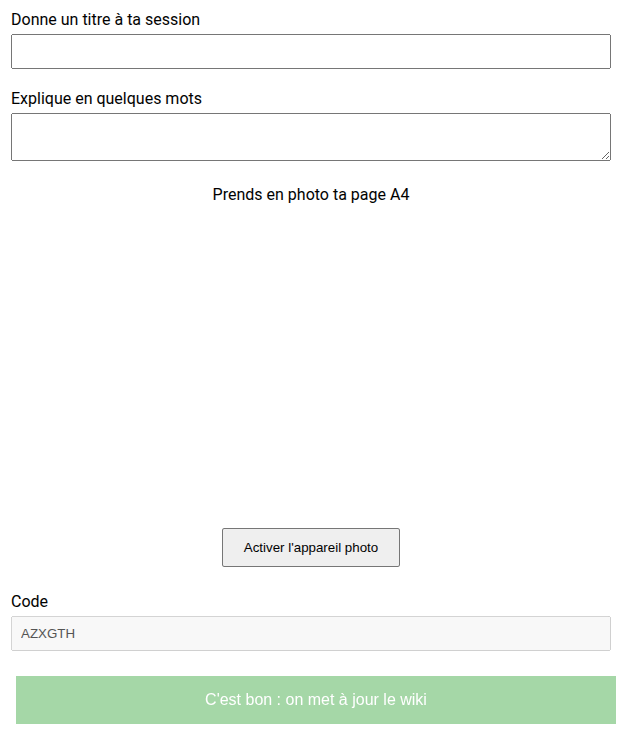

# WikiPitch
Et si on utilisait un wiki pour pitcher les sessions d'un forum ouvert ?

## Le contexte

Un forum ouvert de grande taille (~200 personnes, ~80 sessions dans la journée).
Si tout le monde fait le pitch de sa session, on perd 1 heure.

Pour simplifier les pitchs, on utilise :
- un wiki [Mediawiki](https://www.mediawiki.org/wiki/MediaWiki) (le même que Wikipedia).
- Des étiquettes autocollantes QR code

Chaque personne qui propose une session en la décrivant sur un papier A4 colle un QR code sur ce papier.
Cela donne immédiatement une page dédiée à la session où on peut renseigner les informations utiles et où tous les participants peuvent intervenir.

## Le problème

Initialiser la page d'une session est fastidieux.

Tout le monde n'est pas à l'aise avec la création d'une page dans un wiki.

C'est encore plus compliqué si on veut mettre en ligne une photo de la feuille A4 décrivant la session.

## La solution

Les pages correspondant à chaque QR code sont initialisées avec un lien vers l'application WikiPitch qui permet de rapidement créer une page pour la session.

## Les détails techniques

### Attention : on est dans la preuve de concept. Il ne faut s'attendre, ni à une expérience utilisateur en béton, ni à du code maintenable, ni à une absence de bugs.

L'application frontend (Svelte/ts) est installée dans un dossier `wikipitch` à la racine du site du wiki

Les pages correspondant aux QR codes sont initialisées avec des liens tels que `https://monwiki.site/wikipitch/?code=LECODEDELAPAGE`

Ces liens conduisent à un formulaire où on peut rapidement donner un titre et prendre en photo sa page A4.

La mise à jour du wiki est effectuée par un appel unique à une app backend avec un POST sur `https://monwiki.site/wikipitch/actions/register_session`
L'app backend (python/flask) doit être installée par un moyen quelconque sur l'URL `https://monwiki.site/wikipitch/actions`

Dans le cadre du POC, l'ensemble a été installé sur Apache + Phusion Passenger.
